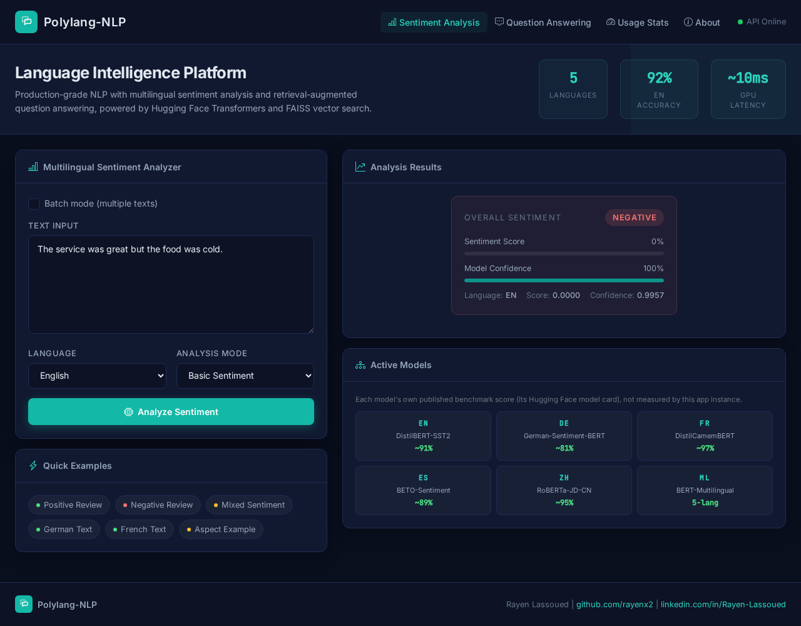
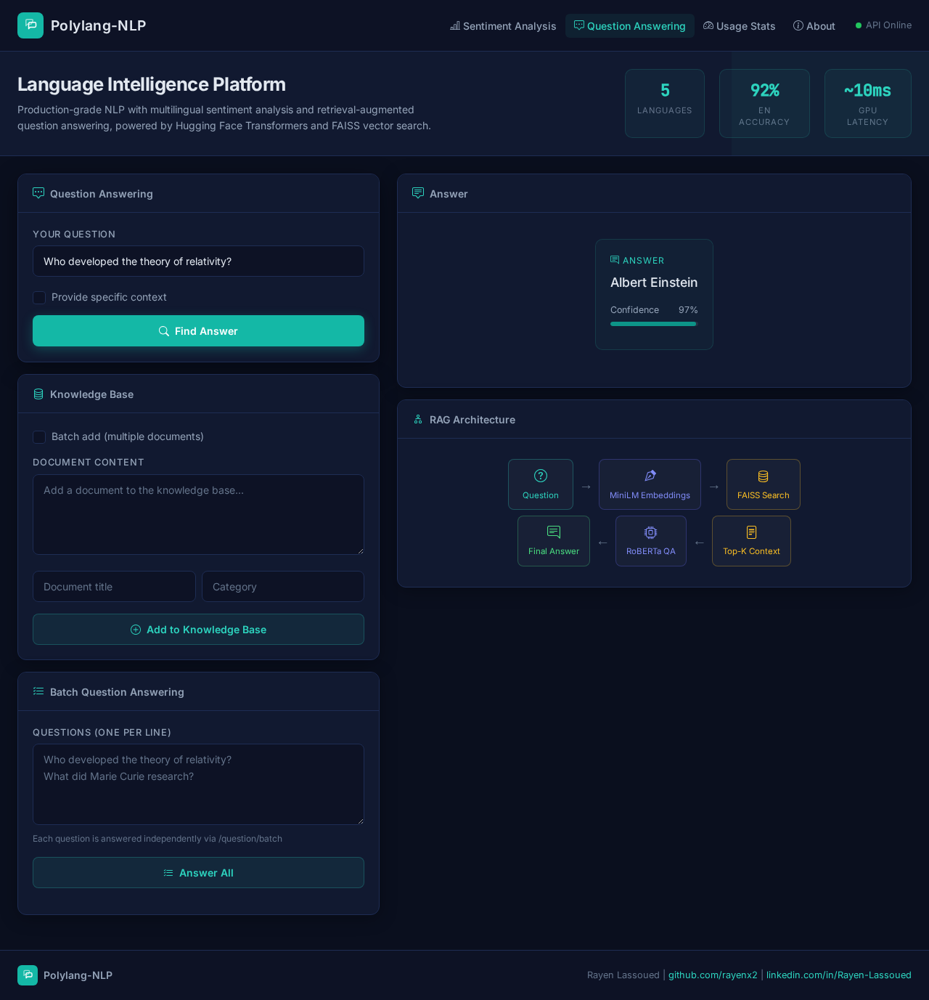
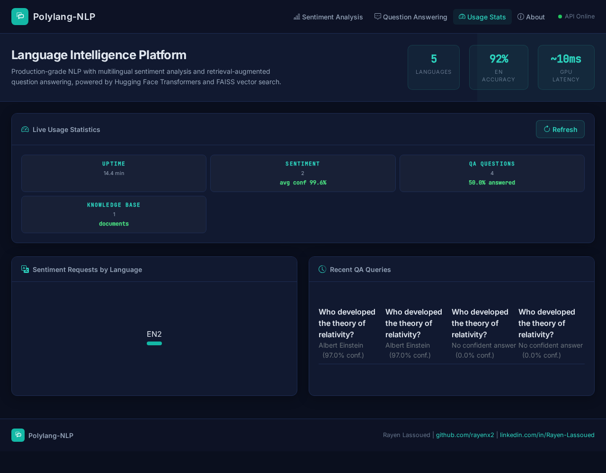
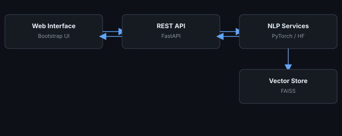

# Polylang-NLP

<p align="center">
  
  
  
  
  
</p>

<p align="center">
  <strong>Multilingual sentiment analysis and retrieval-augmented question answering with transformers</strong><br/>
  PyTorch inference · Hugging Face models · FAISS semantic search · FastAPI serving · 5 European/global languages
</p>

<p align="center">
  
</p>

A state-of-the-art Natural Language Processing system that combines multilingual sentiment analysis and question-answering capabilities with retrieval augmentation. Built with industry-standard ML/AI engineering practices, this system demonstrates advanced NLP techniques and production-ready architecture.

## Live Demo

**Live:** [https://polylang-nlp-demo.vercel.app](https://polylang-nlp-demo.vercel.app)

It shows pre-computed real example results from the sentiment analyzer and QA system,
plus a live preview of the `/stats` usage dashboard.

## Screenshots

<table align="center">
  <tr>
    <td align="center" width="33%"><sub>Sentiment analysis, real inference</sub></td>
    <td align="center" width="33%"><sub>Question answering, FAISS retrieval + RoBERTa QA</sub></td>
    <td align="center" width="33%"><sub>Live usage statistics</sub></td>
  </tr>
  <tr>
    <td align="center" width="33%"></td>
    <td align="center" width="33%"></td>
    <td align="center" width="33%"></td>
  </tr>
</table>

## How It Works

1. A request arrives at one of `app/api/main.py`'s endpoints (`/sentiment`, `/sentiment/aspects`, `/documents`, `/question`, `/stats`)
2. For sentiment, `SentimentAnalyzer` lazily loads the pretrained transformer for the requested language (English, Spanish, French, German, or Chinese) and runs inference, no fine-tuning happens at request time
3. For question answering, `QASystem` embeds the question with a sentence-transformer and searches the FAISS index (`vector_db.py`) for the top-k most relevant documents in the knowledge base
4. The retrieved context is passed to a HuggingFace extractive QA model (`deepset/roberta-base-squad2`), which returns an answer span plus a confidence score and the source document(s) it came from
5. Every request is logged with method, path, status code, and duration; input validation rejects empty or oversized (>5000 char) text with HTTP 422
6. `/stats` aggregates in-memory counters (requests per language, average confidence, QA answer rate, recent query history) for the Usage Stats tab in the web UI
7. The web UI (`ui/index.html`, plain Bootstrap + JS, no build step) and the standalone `demo/index.html` both call this same API. The demo uses pre-computed examples so it works with zero backend

## Features

### Multilingual Sentiment Analysis
- **Multi-language Support**: Analyzes sentiment in multiple languages (English, Spanish, French, German, and Chinese)
- **Fine-grained Analysis**: Provides detailed sentiment scores and confidence metrics
- **Aspect-based Sentiment**: Identifies sentiment for specific aspects mentioned in text
- **Context-aware Processing**: Handles context-specific sentiment detection
- **Batch Processing**: Efficiently processes large datasets with optimized batch operations

### Question-Answering with Retrieval Augmentation
- **Semantic Search**: Uses dense vector embeddings for semantic similarity search
- **Knowledge Base Management**: Dynamically add, update, and query documents
- **Source Attribution**: Provides confidence scores and source attribution for answers
- **Context Integration**: Answers questions based on provided context or retrieved documents
- **Efficient Indexing**: FAISS-powered vector database for fast similarity search at scale

## System Architecture

The Polylang-NLP system is built with a modular, microservices-oriented architecture that ensures scalability, maintainability, and extensibility.

### High-Level Architecture

<p align="center">
  
</p>

### Project Structure

```
Polylang-NLP/
├── app/                      # Core application code
│   ├── api/                  # FastAPI implementation
│   │   ├── main.py           # API entry point and route definitions
│   │   └── models.py         # Pydantic models for request/response validation
│   ├── sentiment_analysis/   # Sentiment analysis components
│   │   └── analyzer.py       # Multilingual sentiment analyzer implementation
│   ├── question_answering/   # QA system components
│   │   ├── qa_system.py      # Question answering system implementation
│   │   └── vector_db.py      # Vector database for document retrieval
│   └── common/               # Shared utilities and configurations
│       ├── config.py         # Configuration management
│       ├── data_utils.py     # Data processing utilities
│       └── text_utils.py     # Text preprocessing utilities
├── data/                     # Sample datasets
│   ├── sample_reviews.json   # Sample multilingual reviews for sentiment analysis
│   └── sample_knowledge_base.json # Sample documents for question answering
├── models/                   # Pre-trained models storage
├── utils/                    # Utility scripts
│   ├── download_models.py    # Script to download required models
│   ├── sentiment_demo.py     # Sentiment analysis demonstration
│   └── qa_demo.py            # Question answering demonstration
├── ui/                       # Web interface
│   ├── index.html            # Main HTML interface
│   ├── styles.css            # CSS styling
│   └── app.js                # JavaScript for UI interactions
├── tests/                    # Comprehensive test suite
│   ├── test_sentiment_analyzer.py # Tests for sentiment analysis
│   ├── test_qa_system.py     # Tests for question answering
│   ├── test_vector_db.py     # Tests for vector database
│   └── test_api.py           # Tests for API endpoints
├── Dockerfile                # Docker configuration
├── docker-compose.yml        # Docker Compose for multi-container setup
├── requirements.txt          # Python dependencies
└── run.py                    # Main entry point script
```

## Technologies Used

- **Machine Learning & NLP**:
  - PyTorch (2.0+) for tensor operations and GPU inference
  - Hugging Face Transformers for pretrained sentiment and QA models
  - Sentence Transformers for semantic embeddings

- **Vector Database**:
  - FAISS for efficient similarity search and retrieval
  - Custom vector indexing and management

- **API & Web Framework**:
  - FastAPI with automatic OpenAPI documentation
  - Pydantic for data validation and settings management
  - Uvicorn ASGI server

- **Frontend**:
  - Bootstrap 5 for responsive UI components
  - Modern JavaScript for interactive features

- **DevOps & Deployment**:
  - Docker and Docker Compose for containerization
  - Environment-based configuration management

- **Testing & Quality Assurance**:
  - Pytest for comprehensive test coverage
  - Continuous integration ready

## Getting Started

### Prerequisites
- Python 3.8+
- pip or conda for package management
- 8GB+ RAM recommended (for running transformer models)
- CUDA-compatible GPU (optional, for faster inference)

### Installation

#### Option 1: Standard Installation

1. Clone the repository:
```bash
git clone https://github.com/Hamilas/Polylang-NLP.git
cd polylang-nlp
```

2. Create a virtual environment:
```bash
python -m venv venv
source venv/bin/activate  # On Windows: venv\Scripts\activate
```

3. Install dependencies:
```bash
pip install -r requirements.txt
```

4. Download the required models:
```bash
python -m utils.download_models
```

#### Option 2: Docker Installation

1. Clone the repository:
```bash
git clone https://github.com/Hamilas/Polylang-NLP.git
cd polylang-nlp
```

2. Build and run with Docker Compose:
```bash
docker compose up --build
```

### Running the System

#### Running the API

```bash
python run.py --host 0.0.0.0 --port 8000
```

The API will be available at `http://localhost:8000`. API documentation is available at `http://localhost:8000/docs`.

With Docker Compose, the API is exposed on `http://localhost:8043` and the web UI on
`http://localhost:8044`.

#### Running the Demo UI

After starting the API, open a web browser and navigate to:
```
http://localhost:8044
```

#### Running the Demo Scripts

For sentiment analysis demonstration:
```bash
python -m utils.sentiment_demo --mode all
```

For question answering demonstration:
```bash
python -m utils.qa_demo --mode interactive
```

### Configuration

The system can be configured using environment variables or a configuration file:

```bash
# API configuration
export API_HOST=0.0.0.0
export API_PORT=8000
export API_DEBUG=true

# Model configuration
export SENTIMENT_DEFAULT_LANGUAGE=en
export QA_MODEL=deepset/roberta-base-squad2
export RETRIEVER_MODEL=sentence-transformers/all-MiniLM-L6-v2

# Logging
export LOG_LEVEL=INFO
```

## Usage Examples

```bash
# Sentiment analysis
curl -X POST http://localhost:8043/sentiment \
  -H "Content-Type: application/json" \
  -d '{"text": "The service was great but the food was cold.", "language": "en"}'

# Aspect-based sentiment
curl -X POST http://localhost:8043/sentiment/aspects \
  -H "Content-Type: application/json" \
  -d '{"text": "Great camera, poor battery life.", "aspects": ["camera", "battery"], "language": "en"}'

# Add a document to the knowledge base, then ask a question about it
curl -X POST http://localhost:8043/documents \
  -H "Content-Type: application/json" \
  -d '{"text": "Albert Einstein developed the theory of relativity.", "metadata": {"title": "Einstein"}}'

curl -X POST http://localhost:8043/question \
  -H "Content-Type: application/json" \
  -d '{"question": "Who developed the theory of relativity?"}'
```

Batch variants of all three (`/sentiment/batch`, `/documents/batch`, `/question/batch`) accept a
list instead of a single item, also exposed as toggles/panels in the web UI. Full request/response
schemas are in the interactive docs at `/docs`.

## Performance and Benchmarks

Figures below are each model's own published benchmark score (from its Hugging Face model
card), not measured live by this app instance.

### Sentiment Analysis Performance

| Language | Model                                        | Accuracy (published) | Dataset  |
|----------|-----------------------------------------------|-----------------------|----------|
| English  | distilbert-base-uncased-finetuned-sst-2       | ~91%                  | SST-2    |
| Spanish  | finiteautomata/beto-sentiment-analysis        | ~89%                  | TASS     |
| French   | cmarkea/distilcamembert-base-sentiment        | ~97%                  | Allocine |
| German   | oliverguhr/german-sentiment-bert              | ~81%                  | GermEval |
| Chinese  | uer/roberta-base-finetuned-jd-binary-chinese  | ~95%                  | JD reviews |

### Question Answering Performance

| Metric              | Score (published) | Dataset    |
|---------------------|--------------------|------------|
| Exact Match         | ~78%               | SQuAD v2.0 |
| F1 Score            | ~81%               | SQuAD v2.0 |
| Latency (measured)  | ~10ms on RTX 3050  | -          |

## European Market Use Cases

Multilingual NLP is a core requirement for any company operating across EU markets:

- **E-commerce platforms** (Zalando, Otto, Cdiscount): analyze customer reviews in
  German, French, Spanish, and English without separate per-language pipelines
- **Hospitality & travel** (Booking.com, TUI, Trivago): aggregate sentiment from
  hotel reviews across languages, surface aspect-level issues (cleanliness, staff, food)
- **Customer support platforms** (Zendesk-style SaaS, telecom support desks like
  Deutsche Telekom, Vodafone): auto-triage tickets by sentiment and urgency
- **Internal knowledge bases** (consulting firms, GIZ-style international
  organizations): RAG question answering over internal documents in multiple languages

## Contributing

Contributions are welcome! Please feel free to submit a Pull Request.

1. Fork the repository
2. Create your feature branch (`git checkout -b feature/amazing-feature`)
3. Commit your changes (`git commit -m 'Add some amazing feature'`)
4. Push to the branch (`git push origin feature/amazing-feature`)
5. Open a Pull Request

### Development Guidelines

- Follow PEP 8 style guidelines
- Write tests for new features
- Update documentation as needed
- Add type hints to function signatures

## Author

**Rayen Lassoued**
[github.com/Hamilas](https://github.com/Hamilas) | [LinkedIn](https://www.linkedin.com/in/lassoued-rayen/)

## License

This project is licensed under the MIT License - see the LICENSE file for details.
